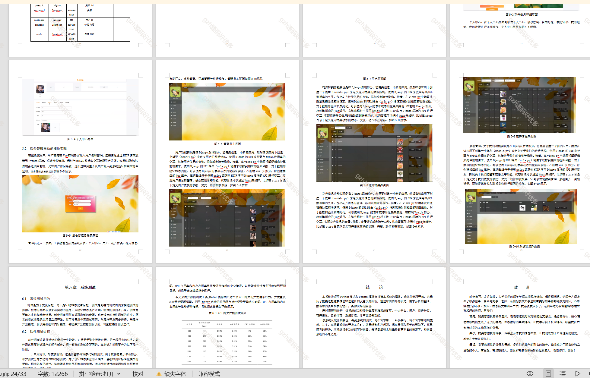

# python003
python003基于Django的花卉鲜花商城系统
 
## 查看主页获取源码

### 一、关键词

鲜花销售商城、花卉、花店

 

### 二、作品包含

源码+数据库+设计文档万字+PPT+全套环境和工具资源+部署教程

 

### 三、项目技术

前端技术：Html、Css、Js、Vue2.0、Element-ui
后端技术：Python3.7、Django2.0

  

 

### 四、运行环境（以下版本亲测，其他版本未知，请自测）

开发工具：PyCharm + VSCODE

数据库：MySQL5.7（最低要5.7版本）

数据库管理工具：Navicat10+

Python：Python3.7

前端Nodejs：14

浏览器：谷歌浏览器

 

### 五、项目介绍

项目编号：python003

花卉商城系统是一个综合性的在线销售平台，专注于提供各种花卉植物的购买服务。该系统具备商品浏览、在线下单、支付结算以及订单跟踪等功能，用户可以轻松选购心仪的花卉产品

该系统具备管理员和用户两个主要功能模块。管理员可以管理系统首页、个人中心、用户、花卉种类、花卉信息、自助订花、系统管理、订单管理等。用户则允许查看和编辑个人信息、修改密码以及管理收藏的花卉。

 

### 六、运行截图

